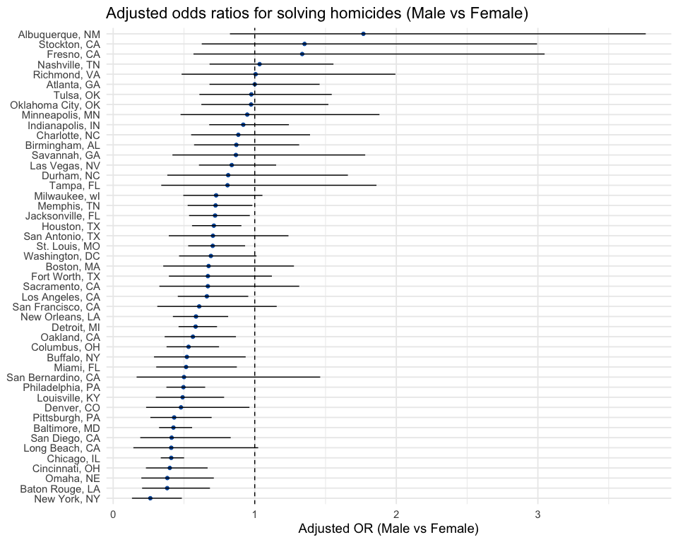
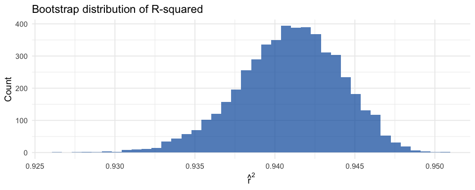
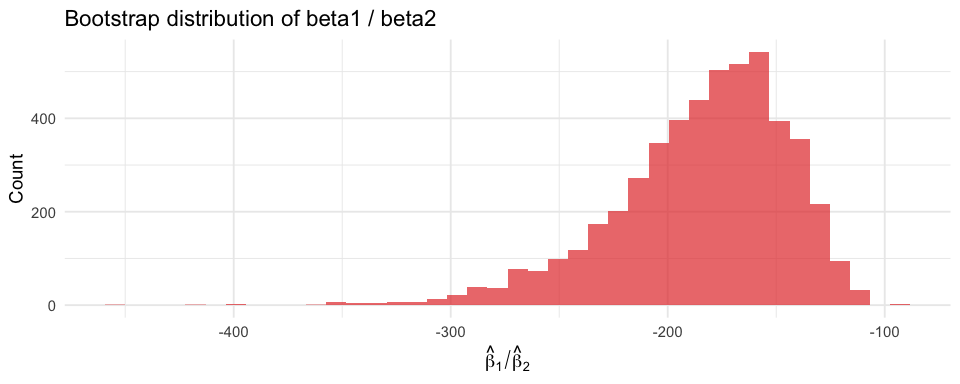

p8105-hw6-yw4662
================

## Problem 1

``` r
# Import homicide data from Washington Post GitHub
homicide_raw <- read_csv(
  "https://raw.githubusercontent.com/washingtonpost/data-homicides/master/homicide-data.csv"
)
```

    ## Rows: 52179 Columns: 12
    ## ── Column specification ────────────────────────────────────────────────────────
    ## Delimiter: ","
    ## chr (9): uid, victim_last, victim_first, victim_race, victim_age, victim_sex...
    ## dbl (3): reported_date, lat, lon
    ## 
    ## ℹ Use `spec()` to retrieve the full column specification for this data.
    ## ℹ Specify the column types or set `show_col_types = FALSE` to quiet this message.

``` r
# Clean and create city_state + solved indicator
homicide_clean <- homicide_raw %>%
  mutate(
    city_state = str_c(city, ", ", state),
    solved = disposition == "Closed by arrest"
  )%>%
  filter(
    !city_state %in% c("Dallas, TX", "Phoenix, AZ", 
                      "Kansas City, MO", "Tulsa, AL")
  ) %>%
  filter(victim_race %in% c("White", "Black")) %>%
  mutate(
    victim_age = as.numeric(victim_age),
    victim_sex = factor(victim_sex),
    victim_race = factor(victim_race)
  )
```

### Baltimore Logistic Regression and Adjusted OR (Male VS Female)

``` r
baltimore_df <- homicide_clean %>%
  filter(city_state == "Baltimore, MD")

baltimore_fit <- glm(
  solved ~ victim_age + victim_sex + victim_race,
  data = baltimore_df,
  family = binomial()
)

baltimore_OR <- baltimore_fit %>%
  tidy(conf.int = TRUE, exponentiate = TRUE) %>%
  filter(term == "victim_sexMale") %>%
  select(term, estimate, conf.low, conf.high)

baltimore_OR
```

    ## # A tibble: 1 × 4
    ##   term           estimate conf.low conf.high
    ##   <chr>             <dbl>    <dbl>     <dbl>
    ## 1 victim_sexMale    0.426    0.324     0.558

### Logistic Regression for Each City and OR (Male VS Female)

``` r
city_ORs <- homicide_clean %>%
  group_by(city_state) %>%
  nest() %>%
  mutate(
    fit = map(
      data,
      ~ glm(solved ~ victim_age + victim_sex + victim_race,
            data = .x,
            family = binomial())
    ),
    tidied = map(
      fit,
      ~ tidy(.x, conf.int = TRUE, exponentiate = TRUE)
    )
  ) %>%
  unnest(tidied) %>%
  filter(term == "victim_sexMale") %>%
  select(city_state, estimate, conf.low, conf.high)
```

    ## Warning: There were 43 warnings in `mutate()`.
    ## The first warning was:
    ## ℹ In argument: `tidied = map(fit, ~tidy(.x, conf.int = TRUE, exponentiate =
    ##   TRUE))`.
    ## ℹ In group 1: `city_state = "Albuquerque, NM"`.
    ## Caused by warning:
    ## ! glm.fit: fitted probabilities numerically 0 or 1 occurred
    ## ℹ Run `dplyr::last_dplyr_warnings()` to see the 42 remaining warnings.

``` r
city_ORs
```

    ## # A tibble: 47 × 4
    ## # Groups:   city_state [47]
    ##    city_state      estimate conf.low conf.high
    ##    <chr>              <dbl>    <dbl>     <dbl>
    ##  1 Albuquerque, NM    1.77     0.825     3.76 
    ##  2 Atlanta, GA        1.00     0.680     1.46 
    ##  3 Baltimore, MD      0.426    0.324     0.558
    ##  4 Baton Rouge, LA    0.381    0.204     0.684
    ##  5 Birmingham, AL     0.870    0.571     1.31 
    ##  6 Boston, MA         0.674    0.353     1.28 
    ##  7 Buffalo, NY        0.521    0.288     0.936
    ##  8 Charlotte, NC      0.884    0.551     1.39 
    ##  9 Chicago, IL        0.410    0.336     0.501
    ## 10 Cincinnati, OH     0.400    0.231     0.667
    ## # ℹ 37 more rows

### Plot of Adjusted ORs by City

``` r
city_ORs %>%
  ggplot(aes(x = estimate, y = fct_reorder(city_state, estimate))) +
  geom_point(color = "#0057A8") +
  geom_errorbar(aes(xmin = conf.low, xmax = conf.high), width = 0) +
  geom_vline(xintercept = 1, linetype = 2) +
  labs(
    title = "Adjusted odds ratios for solving homicides (Male vs Female)",
    x = "Adjusted OR (Male vs Female)",
    y = NULL
  )
```

<!-- -->

### Comment

1.  **Most cities have adjusted ORs near 1**: An OR of 1 means that
    homicides involving male victims and female victims are equally
    likely to be solved after adjusting for covariates. Most cities fall
    between 0.7 and 1.3, indicating little to no difference in solve
    rates by victim sex.

2.  **Cities with very wide confidence intervals**: Some cities have
    long error bars, indicating smaller sample sizes, high uncertainty
    in estimates, and limited ability to draw conclusions.

## Problem 2

``` r
data("weather_df")

weather_clean <- weather_df %>%
  filter(!is.na(tmax), !is.na(tmin), !is.na(prcp))
```

### Bootstrap Resamples and Fits

``` r
# Create 5000 bootstrap resamples
boot_straps <- weather_clean %>%
  bootstrap(n = 5000, id = "strap_id")

boot_results <- boot_straps %>%
  mutate(
    model = map(strap, ~ lm(tmax ~ tmin + prcp, data = .x)),
    glance = map(model, glance),
    tidy = map(model, tidy)
  )

# r^2
boot_r2 <- boot_results %>%
  unnest(glance) %>%
  select(strap_id, r.squared)

# beta1 / beta2
boot_beta_ratio <- boot_results %>%
  unnest(tidy) %>%
  select(strap_id, term, estimate) %>%
  filter(term %in% c("tmin", "prcp")) %>%
  pivot_wider(names_from = term, values_from = estimate) %>%
  mutate(beta_ratio = tmin / prcp) %>%
  select(strap_id, beta_ratio)

boot_summary <- boot_r2 %>%
  inner_join(boot_beta_ratio, by = "strap_id")

boot_summary
```

    ## # A tibble: 5,000 × 3
    ##    strap_id r.squared beta_ratio
    ##    <chr>        <dbl>      <dbl>
    ##  1 0001         0.936      -221.
    ##  2 0002         0.941      -172.
    ##  3 0003         0.939      -218.
    ##  4 0004         0.942      -170.
    ##  5 0005         0.939      -203.
    ##  6 0006         0.940      -198.
    ##  7 0007         0.944      -169.
    ##  8 0008         0.939      -195.
    ##  9 0009         0.940      -179.
    ## 10 0010         0.945      -228.
    ## # ℹ 4,990 more rows

### Distribution and 95% Bootstrap CIs

``` r
# r^2 distribution
p_r2 <- boot_summary %>%
  ggplot(aes(x = r.squared)) +
  geom_histogram(bins = 40, fill = "#0057A8", alpha = 0.7) +
  labs(
    title = "Bootstrap distribution of R-squared",
    x = expression(hat(r)^2),
    y = "Count"
  )

# beta-ratio distribution
p_ratio <- boot_summary %>%
  ggplot(aes(x = beta_ratio)) +
  geom_histogram(bins = 40, fill = "#E53935", alpha = 0.7) +
  labs(
    title = "Bootstrap distribution of beta1 / beta2",
    x = expression(hat(beta)[1] / hat(beta)[2]),
    y = "Count"
  )

p_r2
```

<!-- -->

``` r
p_ratio
```

<!-- -->

### Comment

1.  Bootstrap distribution of $R^2$: the model fits very consistently
    well, with minimal sampling variability in \$R^2%
    - The model explains about 94% of the variance in the response
      variable across bootstrap samples
    - The tight distribution indicates the model’s explanatory power is
      very stable
    - Even if we refit the model on many resampled datasets, the $R^2$
      would remain almost unchanged
2.  Bootstrap distribution of $\frac{\beta_1}{\beta_2}$: the ratio is
    much less stable than $R^2$, showing that estimating the relative
    strength of the two predictors is much less stable than estimating
    the overall model fit
    - The ratio is consistently negative, meaning the two coefficients
      have opposite signs in essentially every bootstrap sample
    - The skewness suggests higher variability in one or both
      coefficients
    - The wide range of values indicates that $\beta_2$ may sometimes be
      small in magnitude, which creates instability in the ratio

``` r
# 95% bootstrap intervals
r2_ci <- boot_summary %>%
  summarise(
    q2.5  = quantile(r.squared, 0.025),
    q97.5 = quantile(r.squared, 0.975)
  )

ratio_ci <- boot_summary %>%
  summarise(
    q2.5  = quantile(beta_ratio, 0.025),
    q97.5 = quantile(beta_ratio, 0.975)
  )

r2_ci
```

    ## # A tibble: 1 × 2
    ##    q2.5 q97.5
    ##   <dbl> <dbl>
    ## 1 0.934 0.947

``` r
ratio_ci
```

    ## # A tibble: 1 × 2
    ##    q2.5 q97.5
    ##   <dbl> <dbl>
    ## 1 -278. -125.
